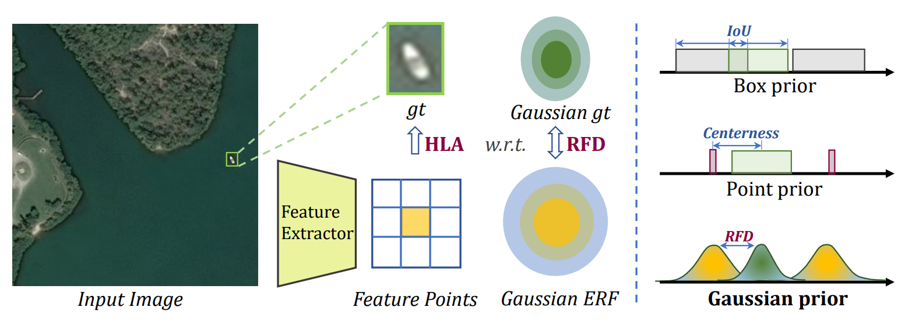
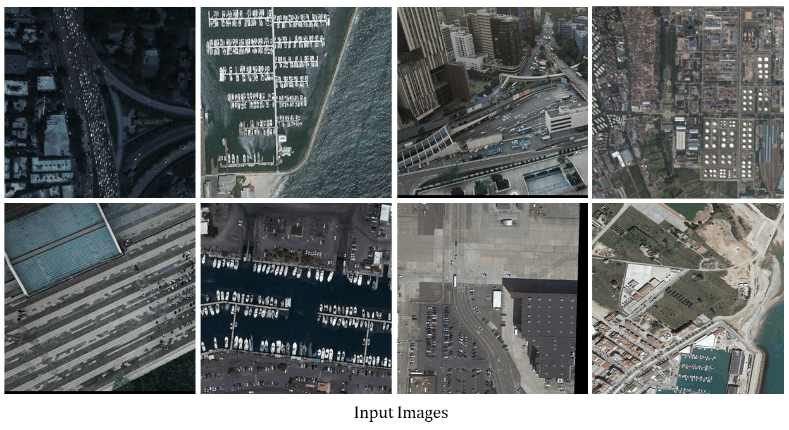

# mmdet-rfla
This is the official implementation of the ECCV2022 paper "RFLA: Gaussian Receptive based Label Assignment for Tiny Object Detection". [arxiv](https://arxiv.org/abs/2208.08738)

## Introduction
RFLA is a label assignment strategy that can replace mainstream anchor-based and anchor-free label strategies and boost their performance on tiny object detection tasks.

**Abstract**: Detecting tiny objects is one of the main obstacles hindering the development of object detection. The performance of generic object detectors tends to drastically deteriorate on tiny object detection tasks. In this paper, we point out that either box prior in the anchor-based detector or point prior in the anchor-free detector is sub-optimal for tiny objects. Our key observation is that the current anchor-based or anchor-free label assignment paradigms will incur many outlier tiny-sized ground truth samples, leading to detectors imposing less focus on the tiny objects. To this end, we propose a Gaussian Receptive Field based Label Assignment (RFLA) strategy for tiny object detection. Specifically, RFLA first utilizes the prior information that the feature receptive field follows Gaussian distribution. Then, instead of assigning samples with IoU or center sampling strategy, a new Receptive Field Distance (RFD) is proposed to directly measure the similarity between the Gaussian receptive field and ground truth. Considering that the IoU-threshold based and center sampling strategy are skewed to large objects, we further design a Hierarchical Label Assignment (HLA) module based on RFD to achieve balanced learning for tiny objects. Extensive experiments on four datasets demonstrate the effectiveness of the proposed methods. Especially, our approach outperforms the state-of-the-art competitors with 4.0 AP points on the AI-TOD dataset.




## Installation and Get Started

Required environments:
* Linux
* Python 3.6+
* PyTorch 1.3+
* CUDA 9.2+
* GCC 5+
* [MMCV](https://mmcv.readthedocs.io/en/latest/#installation)
* [cocoapi-aitod](https://github.com/jwwangchn/cocoapi-aitod)


Install:

Note that this repository is based on the [MMDetection](https://github.com/open-mmlab/mmdetection). Assume that your environment has satisfied the above requirements, please follow the following steps for installation.

```shell script
git clone https://github.com/Chasel-Tsui/mmdet-rfla.git
cd mmdet-rfla
pip install -r requirements/build.txt
python setup.py develop
```
## Core Idea
* Outlier proposals can also be utilized to detect tiny objects since tiny objects may contain no feature points. This work models feature RF and gt as Gaussian in the label assignment process and explores its effectiveness and robustness in tiny object detection.  
* Please note that this repo is unsuited for generic object detection (e.g. VOC, COCO) since this problem is not obvious in medium and large objects.

## Main Results
Table 1. **Training Set:** AI-TOD trainval set, **Validation Set:** AI-TOD test set, 12 epochs. [AI-TOD dataset](https://github.com/jwwangchn/AI-TOD)
Method | Backbone | mAP | AP<sub>50</sub> | AP<sub>75</sub> |AP<sub>vt</sub> | AP<sub>t</sub>  | AP<sub>s</sub>  | AP<sub>m</sub> 
--- |:---:|:---:|:---:|:---:|:---:|:---:|:---:|:---:
FCOS (reproduce)| R-50 | 12.0 | 29.0 | 8.0 | 2.5 | 11.9 | 17.1 | 23.1 
FCOS (paper) | R-50 | 12.6 | 30.4 | 8.1 | 2.3 | 12.2 | 17.2 | 25.0 
FCOS*(P2) | R-50 | 15.4 | 36.3 | 10.9 | 6.0 | 17.6 | 18.5 | 20.7 
FR | R-50 | 11.1 | 26.3 | 7.6 | 0.0 | 7.2| 23.3 | 33.6 
DR | R-50 | 14.8 | 32.8 | 11.4 | 0.0 | 10.8 | 28.3 | 38.0 
FCOS w/ RFLA | R-50 | 13.3 | 32.8 | 8.5 | 4.2 | 14.1 | 18.2 | 23.4 
FCOS*(P2)  w/ RFLA | R-50 | 16.3 | 39.1 | 11.3 | 7.3 | 18.5| 19.8 | 21.8  
FR w/ RFLA | R-50 | 21.1 | 51.6 | 13.1 | **9.5** | 21.2 | 26.1 | 31.5 
DR w/ RFLA | R-50 | **24.8** | **55.2** | **18.5** | 9.3 | **24.8** | **30.3** | **38.2** 

Table 2. **Training Set:** AI-TOD-v2 trainval set, **Validation Set:** AI-TOD-v2 test set, 12 epochs. [AI-TOD-v2 dataset](https://chasel-tsui.github.io/AI-TOD-v2/)
Method | Backbone | mAP | AP<sub>50</sub> | AP<sub>75</sub> |AP<sub>vt</sub> | AP<sub>t</sub>  | AP<sub>s</sub>  | AP<sub>m</sub> 
--- |:---:|:---:|:---:|:---:|:---:|:---:|:---:|:---:
FCOS | R-50 | 13.4 | 32.4 | 8.8 | 2.5 | 12.4 | 19.0 | 26.7 
FR | R-50 | 12.8 | 29.9 | 9.4 | 0.0 | 9.2| 24.6 | 37.0 
DR | R-50 | 16.1 | 35.5 | 12.5 | 0.1 | 12.6 | 28.3 | 40.0
FCOS w/ RFLA | R-50 | 15.6 | 38.2 | 9.6 | 4.4 | 14.6 | 20.9 | 29.5 
FR w/ RFLA | R-50 | 22.6 | 54.8 | 14.5 | 8.6 | 21.7 | 28.8 | 35.5 
DR w/ RFLA | R-50 | **25.7** | **58.9** | **18.8** | **9.2** | **25.5** | **30.2** | **40.2**  

Pretrained Models: [OneDrive Link](https://1drv.ms/u/s!Ao5UiAkIbGJ7xRGZ3AYB7IW8zas2?e=opfU3x)

## Visualization
The images are from the AI-TOD, VisDrone2019 and DOTA-v2 datasets. Note that the <font color=green>green box</font> denotes the True Positive, the <font color=red>red box</font> denotes the False Negative and the <font color=blue>blue box</font> denotes the False Positive predictions.


## Citation
If you find this work helpful, please consider citing:
```bibtex
@inproceedings{xu2022rfla,
  title={RFLA: Gaussian receptive field based label assignment for tiny object detection},
  author={Xu, Chang and Wang, Jinwang and Yang, Wen and Yu, Huai and Yu, Lei and Xia, Gui-Song},
  booktitle={European Conference on Computer Vision},
  pages={526--543},
  year={2022},
  organization={Springer}
}
```
